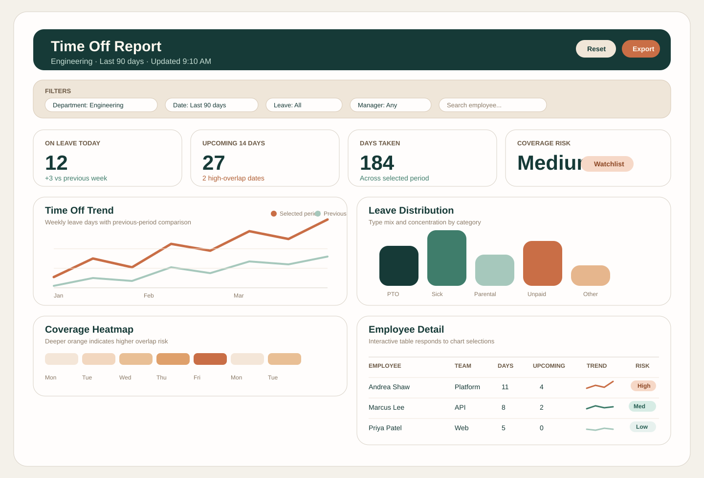

# Time Off Report Redesign Research

Issue: `RDSP-219`  
Updated: `2026-03-31`

## Goal

Redesign the Time Off Report so department leaders can move from "pick a department" to "understand time-off risk, patterns, and individual details" with fewer clicks and clearer prioritization.

## Current Flow Observed From Ticket

The Jira ticket describes a two-step experience:

1. Select a department.
2. View a time-off report for that department with filters and per-user detail.

This flow likely makes department selection a gate instead of a persistent control, which is common in older reporting UIs but less effective for exploratory analysis. Modern BI tools generally keep high-value filters visible while placing summary context above detailed records.

## Research Summary

### Common BI layout patterns

Across Microsoft Power BI and Tableau guidance, the strongest repeated pattern is:

- Put the most important summary information in the upper-left area.
- Keep the first screen focused on scanning, not dense exploration.
- Group related visuals and use white space instead of heavy dividers.
- Treat filters as part of the canvas, not as a separate setup step.
- Let users move from summary to detail with drill, highlight, or linked tables.

Those patterns fit a time-off report well because managers usually need to answer three questions in order:

1. What is happening overall in my department?
2. Where is the risk or anomaly?
3. Which employees or leave entries explain it?

### Source-backed recommendations from BI platforms

#### Layout and hierarchy

- Power BI recommends an overview-first design, aligned visuals, and grouping to create clear hierarchy and faster scanning.
- Tableau recommends putting the main insight in the top-left, limiting the number of major views, and using white space to guide reading flow.
- Both platforms emphasize designing for the actual screen size to reduce scrolling and avoid crowded first views.

#### Filters and interaction

- Power BI supports keeping filters visible on-canvas through slicers while still allowing page, report, and visual-level filtering.
- Tableau recommends exposed filters with explicit labels and interaction cues so users know how to narrow the view.
- For a Time Off Report, this argues for a persistent filter bar rather than a separate "Step 1" page.

#### Detail exploration

- Power BI report guidance emphasizes cross-filtering, drill-through, dynamic titles, and tables with sparklines for detail analysis.
- Tableau guidance recommends coordinated views so a click in a chart updates related views and narrows the table below.
- This is a direct fit for "display by user": the employee table should react to department, date, and leave-type selections instead of being isolated.

#### Accessibility and readability

- Power BI accessibility guidance recommends strong contrast, informative alt text, consistent slicer placement, visible titles, and avoiding color-only meaning.
- Large KPI cards and simplified labels improve scan speed, especially for managers checking staffing risk quickly.

## Recommended UX Direction

### Replace the two-step flow with one analytical workspace

Instead of making department selection a dedicated first screen, use a single report page with a persistent filter bar:

- Department selector
- Date range
- Leave type
- Employment status or team
- Reset filters action

This removes the context switch between setup and analysis. It also matches how BI users expect reports to behave: choose a scope, then refine it in place.

### Use an overview-to-detail structure

Recommended desktop page order:

1. Sticky page header with title, dynamic subtitle, and last refresh timestamp
2. Filter bar with the department selector first
3. KPI row for quick departmental scanning
4. Trend and distribution visuals
5. Calendar-oriented or timeline-oriented absence pattern view
6. Employee detail table with search, sort, and row drill

This supports the natural reading sequence used in BI products: summary first, explanation second, records last.

## Proposed Layout

### Header

- Title: `Time Off Report`
- Dynamic subtitle: `Engineering · Last 90 days`
- Utility actions: export, saved view, reset
- Last updated timestamp near the title, not hidden in a footer

### Filter bar

Use compact controls in a single row on desktop and stacked cards on smaller screens:

- Department: required, searchable dropdown
- Date range: presets like `30 days`, `Quarter`, `Custom`
- Leave type: PTO, sick, unpaid, parental, other
- Team or manager: optional secondary segmentation
- Employee search: quick lookup for name or ID

### KPI row

Show 4 to 5 cards only:

- Employees on leave today
- Upcoming leave in next 14 days
- Total days taken in period
- Average days per employee
- Coverage risk indicator

Each card should include:

- current value
- small comparison to previous period
- short label written in business language

### Main analysis area

Recommended top charts:

- Time-off trend by week or month
- Leave-type distribution
- Department coverage heatmap or absence calendar

Recommended behavior:

- Clicking a chart filters the table
- Hover shows exact counts and date ranges
- Dynamic titles reflect the current filter set

### Employee detail area

Use a dense but readable table with:

- employee name
- team
- manager
- days taken
- upcoming approved days
- balance or allocation if available
- recent trend sparkline
- risk/status chip

Useful actions:

- sort by days taken or upcoming time off
- search by employee
- click row for side panel details

## Recommended Visual Model For This Report

### Best fit

The strongest desktop pattern is a hybrid dashboard-report layout:

- `Top`: KPI summary cards
- `Middle-left`: trend chart
- `Middle-right`: distribution or risk chart
- `Lower-middle`: calendar heatmap or staffing timeline
- `Bottom`: interactive employee table

Why this is the best fit:

- Managers can understand department health within a few seconds.
- Operational questions still resolve on the same page.
- The employee table remains available without dominating the initial scan.

### Avoid

- A separate landing step just to choose department
- More than three major visual areas above the detail table
- Long vertical stacks of filters
- Heavy borders, saturated colors, or chart variety for its own sake
- Using only red and green to indicate staffing risk

## UI Recommendations Specific To Time Off Data

### Use time semantics that reduce ambiguity

- Default to a clear time window, such as last 90 days
- Distinguish historical leave from upcoming approved leave
- Show exact date boundaries in the subtitle
- Use one consistent time grain per chart section

### Prioritize staffing risk, not just leave totals

Raw time-off totals matter less than overlap and concentration. Add indicators for:

- same-day overlap within the department
- manager-defined coverage threshold
- upcoming high-risk days

### Make the table actionable

The table should not just mirror the charts. It should answer follow-up questions:

- Who is currently out?
- Who has the most upcoming time off?
- Which team has clustering next month?
- Which manager has the highest overlap?

### Preserve context during filtering

- Keep filters visible while scrolling
- Update titles and empty states to explain the current scope
- Provide a one-click reset to the default department view

## Mobile And Responsive Guidance

For smaller screens, the report should not try to preserve the desktop layout exactly.

- Stack filters vertically and collapse secondary filters
- Keep only the two most important KPI cards above the fold
- Show one chart at a time before the employee table
- Preserve search and employee drill-in because those are high-value mobile tasks

## Accessibility Requirements

- Meet at least 4.5:1 contrast for text against its background
- Add alt text to each non-decorative visual
- Use labels or icons in addition to color for risk states
- Keep filter placement consistent across views
- Ensure keyboard navigation reaches filters, charts, and the employee table in a logical order

## Suggested Information Architecture

If the report grows, split it into tabs instead of adding more content to one page:

- `Overview`
- `By Employee`
- `Calendar`
- `Trends`

The first release should still start with a single strong overview page unless the dataset is already too complex for one-screen scanning.

## Example Layout Notes

The mockup image in this folder illustrates:

- a persistent department-first filter bar
- a four-card KPI overview
- side-by-side summary charts
- a lower calendar/risk panel
- a bottom employee table for drill-down

## Sources

- Microsoft Learn, "Power BI reports overview": https://learn.microsoft.com/en-us/power-bi/create-reports/power-bi-reports-overview
- Microsoft Learn, "Tips for Designing a Great Power BI Dashboard": https://learn.microsoft.com/en-us/power-bi/create-reports/service-dashboards-design-tips
- Microsoft Learn, "Design Power BI reports for accessibility": https://learn.microsoft.com/en-us/power-bi/create-reports/desktop-accessibility-creating-reports
- Tableau Help, "Best Practices for Effective Dashboards": https://help.tableau.com/current/pro/desktop/en-us/dashboards_best_practices.htm
- Tableau Blueprint, "Visual Best Practices": https://help.tableau.com/current/blueprint/en-us/bp_visual_best_practices.htm

## Final Recommendation

Move the Time Off Report from a sequential two-step report into a single workspace with persistent filters, an overview-first hierarchy, and a linked employee detail table. In BI terms, this is the most defensible layout because it shortens setup time, improves scanability, and keeps the report useful for both executive review and operational follow-up.
