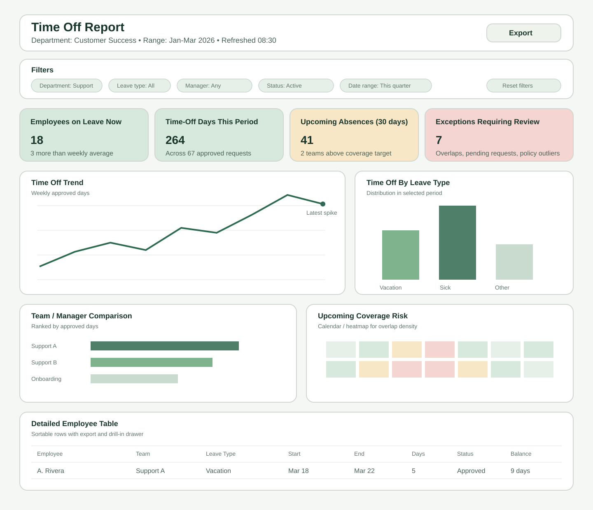

# Time Off Report Redesign Research

This document captures a practical redesign direction for the Time Off Report based on common business intelligence dashboard patterns and general dashboard UX guidance.

It is written for the current flow described in the Jira ticket:

1. The user selects a department.
2. The user reviews department time-off data with filters and user-level detail.

## Goal

Redesign the Time Off Report so it works like a modern operational BI dashboard:

- decision-focused at first glance
- filterable without forcing a multi-step workflow
- able to move from summary to user-level detail
- readable for managers who need both trends and exceptions

## Research Summary

Across Tableau and Microsoft dashboard guidance, the consistent patterns are:

- Show only the most important KPIs first instead of overwhelming the user with all raw data.
- Put visual summaries before detailed tables so users can orient quickly.
- Use the visualization type that matches the question: trends, comparisons, composition, and details should not all share the same component.
- Keep labels, grouping, and color use consistent so the dashboard can be understood at a glance.
- Provide interactivity for drill-down and filtering, but avoid making the user navigate away too early.

These principles fit a Time Off Report well because managers usually need to answer four questions in order:

1. How much time off is being used?
2. Is usage normal or a problem?
3. Which teams, leave types, or dates drive the issue?
4. Which employees require follow-up?

## Problems In The Current Flow

Based on the ticket description, the current design likely has these UX drawbacks:

- Department selection is separated from analysis, which adds friction and hides context.
- The report appears to be data-first rather than insight-first.
- User-level display is available, but the path from overview to employee detail is unclear.
- Filters may exist, but the current layout does not suggest a clear hierarchy of summary, trend, and exception handling.

## Recommended BI Layout

The strongest pattern is a single report page with progressive disclosure.

### 1. Header

Place a compact page header at the top with:

- `Time Off Report`
- selected department
- active date range
- last refresh timestamp
- export action

Reason:

- This keeps the business context visible at all times.

### 2. Persistent Filter Bar

Move department selection into the same page as the report instead of keeping it as a separate first step.

Recommended filters:

- department
- date range
- leave type
- team or manager
- employee status
- location, if relevant in the product

Recommended behavior:

- keep filters in a sticky top bar on desktop
- collapse them into a drawer on smaller screens
- show active filter chips under the bar
- include one-click `Reset filters`

Reason:

- In BI tools, filters work best when they are always available and do not interrupt the analysis flow.

### 3. KPI Summary Row

The first analytical row should be a small set of metric cards:

- employees on leave now
- total time-off days in selected period
- upcoming approved time off in next 30 days
- absence rate or utilization rate
- departments or teams above threshold

Reason:

- This gives an at-a-glance operational summary before the user reads charts or tables.

### 4. Main Insight Row

Use two wide panels:

- left: `Time Off Trend` line or area chart by week or month
- right: `Time Off By Leave Type` stacked bar or donut, depending on category count

Reason:

- Managers need both change over time and mix by category.

### 5. Secondary Insight Row

Use two more focused panels:

- left: `Team / Manager Comparison` ranked horizontal bar chart
- right: `Upcoming Coverage Risk` heatmap or calendar-style occupancy view

Reason:

- This row supports staffing decisions, not just historical review.

### 6. Exceptions Panel

Add a dedicated panel for records requiring attention:

- overlapping approved absences
- unusually high balances or usage
- pending requests nearing start date
- policy outliers

Reason:

- Exception reporting is a strong BI pattern because it directs action instead of forcing users to scan the whole table.

### 7. Detailed Employee Table

Place the detailed table last on the page.

Recommended columns:

- employee
- team
- manager
- leave type
- start date
- end date
- days
- status
- balance remaining

Recommended behaviors:

- sortable columns
- row click opens side panel with employee-level history
- column visibility control
- export current filtered result set

Reason:

- Tables are best used for confirmation and follow-up after the dashboard identifies where to look.

## Recommended UX Updates

### Replace The Two-Step Flow

Replace the current step-based interaction with a single-page report that loads a default department or the last viewed department.

If the product requires an explicit first choice, keep the selector in the header and load the dashboard immediately after selection without a separate screen.

### Use Clear Visual Hierarchy

Order the content like this:

1. context
2. filters
3. KPIs
4. patterns and trends
5. exceptions
6. record-level detail

This is the standard BI reading order and reduces cognitive load.

### Prefer Drill-Down Over Navigation

Instead of sending the user to separate report pages, use:

- chart click filters the table
- row click opens detail drawer
- hover tooltips for exact values

This keeps the user oriented in the same reporting context.

### Make Status Easy To Scan

Use restrained semantic color:

- blue for neutral summaries
- green for healthy values
- amber for warnings
- red for staffing or policy risk

Avoid using color alone. Add icons, labels, or badges for accessibility.

### Support Manager Questions Directly

The dashboard should explicitly answer common questions:

- Who is out now?
- Which team has the highest planned absence load?
- Which leave type is increasing?
- Where do we have overlapping time off?
- Which records need action today?

If a panel does not support one of these questions, it is likely noise.

### Empty, Loading, And Error States

Recommended states:

- empty filter result: explain why no rows match and offer reset
- no department selected: show a guided starter state with recent departments
- loading: preserve layout with skeleton cards and panels
- stale data: show last refresh timestamp and reload affordance

## Proposed Visual Layout

The mockup below shows the recommended arrangement:

### Layout Notes

- Desktop should use a 12-column grid.
- KPI cards should stay in one row on desktop and wrap to 2x2 on tablet.
- The detailed table should remain full width below the analytical panels.
- On mobile, prioritize filters, KPI cards, exceptions, and the employee list; complex comparison charts can stack vertically.

## Recommended Component Choices

Use these component types for the corresponding data questions:

| Question | Best Component |
| --- | --- |
| Current operational summary | KPI cards |
| Trend over time | line chart or area chart |
| Leave type distribution | stacked bar or donut |
| Team comparison | ranked horizontal bars |
| Dense scheduling conflicts | heatmap or calendar occupancy grid |
| User-level auditing | data table with sort and export |

## Suggested Visual Style

For a modern internal BI report, use:

- neutral background with strong contrast
- one accent color for selected filters and primary charts
- limited semantic colors for status only
- compact cards with clear labels and secondary metadata
- consistent date formatting across cards, charts, and table rows

Typography should favor clarity over brand expression in the report body. The emphasis should come from spacing and hierarchy, not decoration.

## Implementation Priorities

If the redesign is phased, implement in this order:

1. Merge department selection and report into a single page.
2. Add KPI summary row and re-order the report around insight-first hierarchy.
3. Add team comparison and coverage risk visualizations.
4. Improve the detailed employee table with sorting, export, and drill-in.
5. Add exception-focused alerts and saved filter defaults.

## Recommendation

The recommended redesign is:

- a single-page dashboard
- always-visible filters
- KPI-first summary
- trend and comparison visuals in the middle
- an exception panel for actionability
- a detailed table at the bottom for confirmation and export

This is the most credible BI-oriented update because it matches how managers scan operational dashboards: summary first, explanation second, record detail last.

## Sources

- Tableau, "What is a dashboard? A complete overview"  
  https://www.tableau.com/dashboard/what-is-dashboard
- Microsoft Learn, "View and interact with Power BI dashboards"  
  https://learn.microsoft.com/en-us/power-bi/consumer/end-user-dashboard-open

## Scope Notes

- This research is a synthesis of general BI dashboard guidance applied to the Time Off Report use case described in Jira.
- The ticket provided only a textual description of the current report flow, so the recommendations focus on layout, interaction model, and information hierarchy rather than pixel-level critique of the current screenshots.
- The companion SVG is intentionally low fidelity so it can communicate layout structure without implying final visual design decisions.
